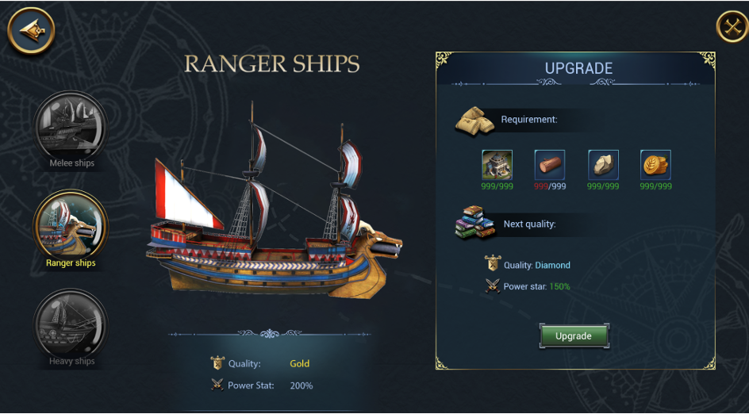
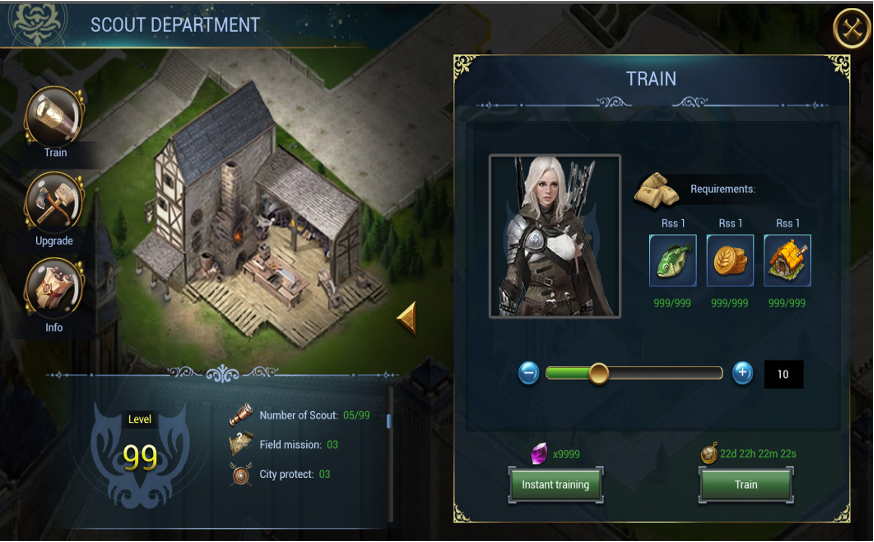
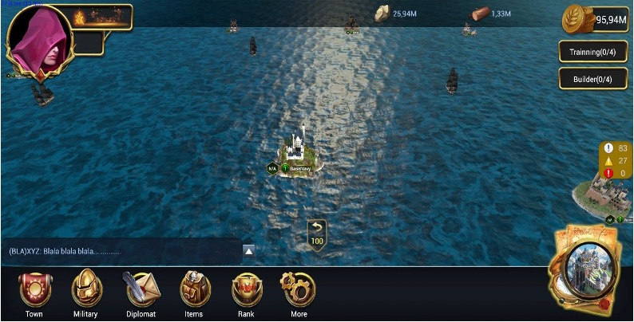

# KOS Backend




## Getting started

## Developing

### Prerequisites

<li>JDK 11 temurin</li>
<li>Maven 3.6.3</li>
<li>IntelliJ IDEA community 20.02</li>
<li>Kafka (dockerized)</li>
<li>PostgresQL (dockerized)</li>

### Setting up local eviroment
For sake of simplicity, we use docker to run self-host persistent service, chat service and message brokers. Configuration could be found in docker-compose.dev
```shell
cd infra
./build_infra.sh
```

#### Seed database <br>
Import database initial data via <b>init.sql</b> script, found in ./init.sql


### Run app

Import Run configuration into IDE. Folder named .run could be found in extracted folder above


Configure .env path in IDE via EnvFile plugin


Make sure to clean all built folder before running app

```shell
mvn clean
```

## Configuration
> Enviroment variables

```shell
SPRING_PROFILES_ACTIVE= # app profile of your choice. Mapped to application-x.yaml

#database 
DATABASE_HOST= 
DATABASE_PORT=
DATABASE_NAME=
DATABASE_USERNAME=
DATABASE_PASSWORD=

# email provider
SEND_GRID_USR= 
SEND_GRID_PSW=

#jwt authentication
JWT_SECRET= 

# redis 
REDIS_HOST= 
REDIS_PORT=

# s3 storage
DGS_SPACE_KEY=
DGS_SPACE_SECRET=
DGS_SPACE_HOST=
DGS_SPACE_REGION=
DGS_SPACE_BUCKET=


# kafka
KAFKA_HOST=
KAFKA_PORT=

# rocket chat
ROCKET_HOST=
ROCKET_PORT=
ROCKET_ADMIN_USER=
ROCKET_ADMIN_PSW=
ROCKET_KEY=

#rabbit mq
RABBITMQ_HOST=
RABBITMQ_PORT=
RABBITMQ_USER=
RABBITMQ_PSW=
```
### Deploying

Build docker image

```shell
cd app
cd kos-backend
export BRANCH=stagingv2
sh "./mvnw -pl kos-app -am package -Dmaven.test.skip=true"        
sh "docker build -f ./Dockerfile.kos.dev -t registry.gitlab.com/bitplay1/kos/kos-backend/app-$BRANCH ."


sh "./mvnw -pl admin-app -am package -Dmaven.test.skip=true"
sh "docker build -f ./Dockerfile.admin.dev -t registry.gitlab.com/bitplay1/kos/kos-backend/admin-$BRANCH ."


sh "./mvnw -pl cron-job -am package -Dmaven.test.skip=true"
sh "docker build -f ./Dockerfile.cronjob.dev -t registry.gitlab.com/bitplay1/kos/kos-backend/cron-$BRANCH ."


sh "./mvnw -pl consumer -am package -Dmaven.test.skip=true "
sh "docker build -f ./Dockerfile.consumer.dev -t registry.gitlab.com/bitplay1/kos/kos-backend/consumer-$BRANCH ."
                    
```


Run image
```shell
cd app
sh ./build-app.sh
```


## Api Reference

Api specification could be found <a href='https://drive.google.com/drive/folders/1dap5cmOlPNNYu3_71BxLn3g60CwohmHW'>here</a>


## Gameplay




## Architectural design

### Client-server

### Packages

### Building upgrades mechanism
